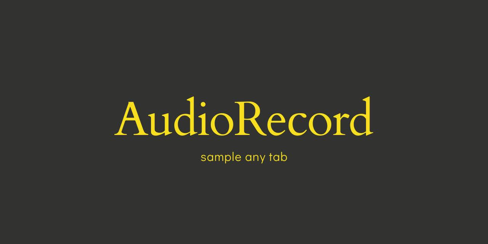

---

  

• [Introduction](#introduction)• [Features](#features) • [Installation](#installation) • [Usage](#usage) • [Privacy and Permissions](#privacy-and-permissions) • [License](#license) •

## Introduction

The AudioRecord Chrome Extension provides a simple and efficient way to capture audio from websites, podcasts, music, or any other audio source playing in your Chrome/Brave browser.

## Features

- Record audio from the current tab in Google Chrome or Brave.
- Save recorded audio as a downloadable file.

## Installation

To install the AudioRecord Extension on Chrome, follow these steps:

1. Download and unzip the files.
2. Open your Google Chrome/Brave browser.
3. Open up Window -> Extensions.
4. Turn on 'Developer Mode'.
5. Select 'Load Unpacked'.
6. Navigate to the AudioRecord folder.
7. Open and click select.
8. The AudioRecord extension will be installed and ready to use.

## Usage

Once the AudioRecord extension is installed, you can begin using it to record audio from the current tab:

1. Open a tab that contains the audio you want to record.
2. Locate the AudioRecord extension icon in the browser toolbar and click on it.
3. The extension popup window will appear.
4. Click the "Rec" button to initiate the audio recording.
5. The recording will commence.
6. To stop the recording, click the "Stop" button.
7. Once the recording is stopped, the file will automatically download. 

## Privacy and Permissions

The AudioRecord extension requires the following permissions:

- "activeTab": Necessary to access the audio being played in the current tab.
- "storage": Used for saving and retrieving user settings and recorded audio files.

We prioritize your privacy and security. The extension does not collect any personal information or transmit any data to external servers.

## License

AudioRecord is released under the [MIT License](https://opensource.org/licenses/MIT). You are free to modify and distribute this extension in accordance with the terms of the license.
